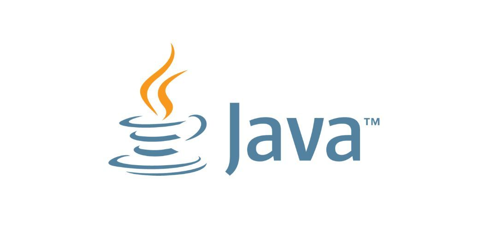

# JavaHub

​  ​

​ 

​​

---

现负责人员[2023 第六届]：👩‍💻史佳颖[^Profile^](https://github.com/qinranguchangsheng)，👨‍💻何江涛[^Profile^](https://github.com/Tiga111)，👨‍💻何人杰[^Profile^](https://github.com/h5933567)，👨‍💻牛彬宇；

往届负责人：

* 2022 第五届：

  🧑‍💻徐金辉[^Profile^](https://github.com/Rocky77JHxu)，🧑‍💻李龙辉，🧑‍💻万枢涵；
* 2021 第四届：

  🧑‍💻吕述杭[^Profile^](https://github.com/xiaohangguo)，🧑‍💻李程翔，👩‍💻张露；

‍
